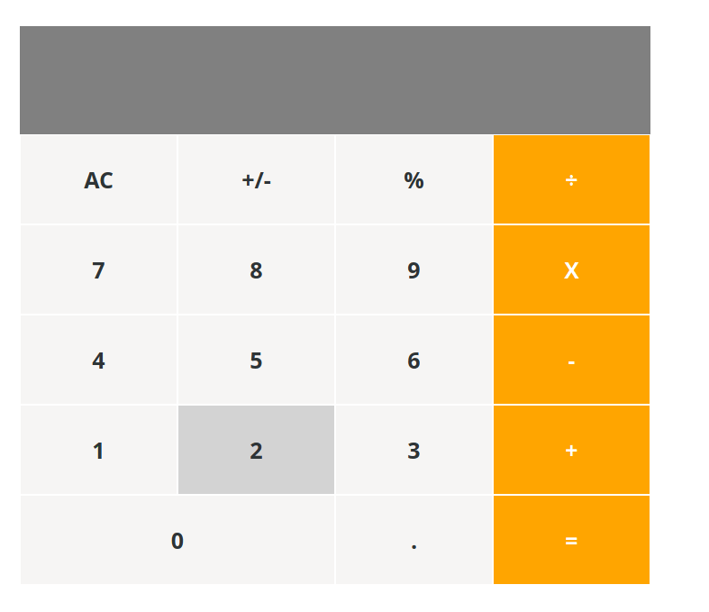

# react-calculator
I built a calculator for Math-magicians Inc using create-react-app,

- Basic Calculator
- Users can perform basic calculations with ease

# Screenshot


# Live Demo
[Live Demo Link](https://react-calculator2.herokuapp.com/) 


# Built With

- HTML 
- CSS
- JAVASCRIPT
- NPM
- REACT
- NODE
- HEROKU
- ESLINT
- STYLELINT
- GITHUB ACTIONS

### Usage
- Clone the project 
```
- Run `npm install` to install the local dependencies
- Run `npm start` to launch local development server
- The project should launch in your default browser


## Authors

**Aremu Lucky**

- Github: [@githubhandle](https://github.com/Luckyaremu)
- Twitter: [@twitterhandle](@luckyaremu)
- Linkedin: [linkedin](https://www.linkedin.com/in/lucky-aremu-24807a145/)


# 🤝 Contributing
Contributions, issues and feature requests are welcome!
Feel free to check the issues page

# Show your support
Give a ⭐️ if you like this project!

This project is [MIT](lic.url) licensed.